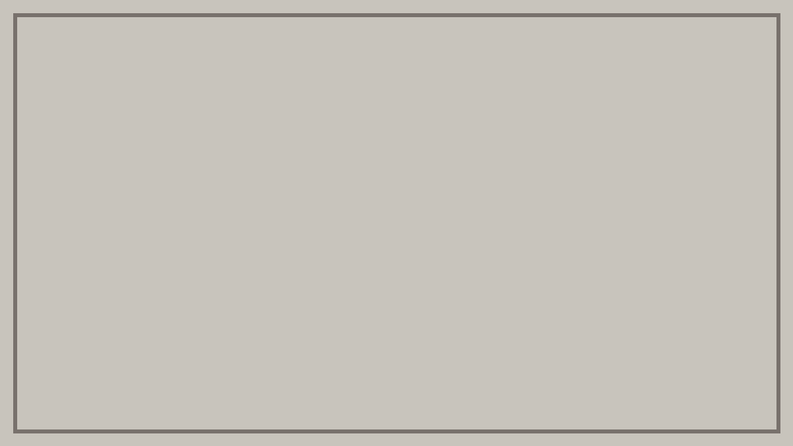

## Why start with spacing

The first thing that stops you when you start building a site is almost always
**spacing**. Whether `8px` or `12px` is right is not something you can decide
without experience. Push on without deciding and every screen ends up with a
different number, and by then it is too late to fix.

So the steps are decided up front, and you pick from them.

```tsx
<Stack space="lg">
  <Hero />
  <Columns space="md" collapseBelow="tablet">
    <Card /> <Card /> <Card />
  </Columns>
</Stack>
```

### You can step outside the scale

If the scale were all you had, the first time you wanted 2px less you would be
stuck again. Values like `space="13px"` work too. **Supported by defaults, free
to step outside** — those two are compatible.

## What to read next

- The list of layout components
- How async state is held
- The foundation that keeps narrow screens from breaking

## Putting images in an article

**Write them as relative paths.**

```markdown
     ← dimensions get added automatically
  ← they do not. The text shifts on load
```


Astro only processes images given as relative paths, and it adds `width` and
`height` for you. With dimensions in place, the space is reserved before the
image arrives, so **the text never jumps down while you are reading.**

Put it in `public/` and write `/img/…` and it is left alone, emitted as a bare
``. `pnpm check` detects that — it blocks image loading and measures
whether the space was actually reserved.
